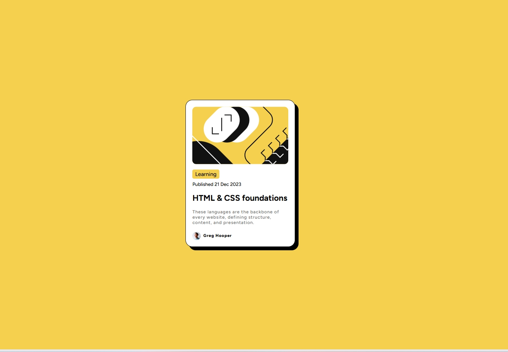

# 📰 Blog Preview Card

A clean and minimal blog preview card component built using HTML and CSS. This project focuses on layout design, hover interactions, and responsive styling — a great UI snippet for content previews.

Live site: [View Demo](https://www.frontendmentor.io/solutions/blog-preview-card-fwoGsdhZTt)  
Challenge: [Frontend Mentor Challenge Link](https://www.frontendmentor.io/challenges/blog-preview-card-ckPaj01IcS)

This project is part of a challenge from [Frontend Mentor](https://www.frontendmentor.io/challenges/blog-preview-card-ckPaj01IcS)
