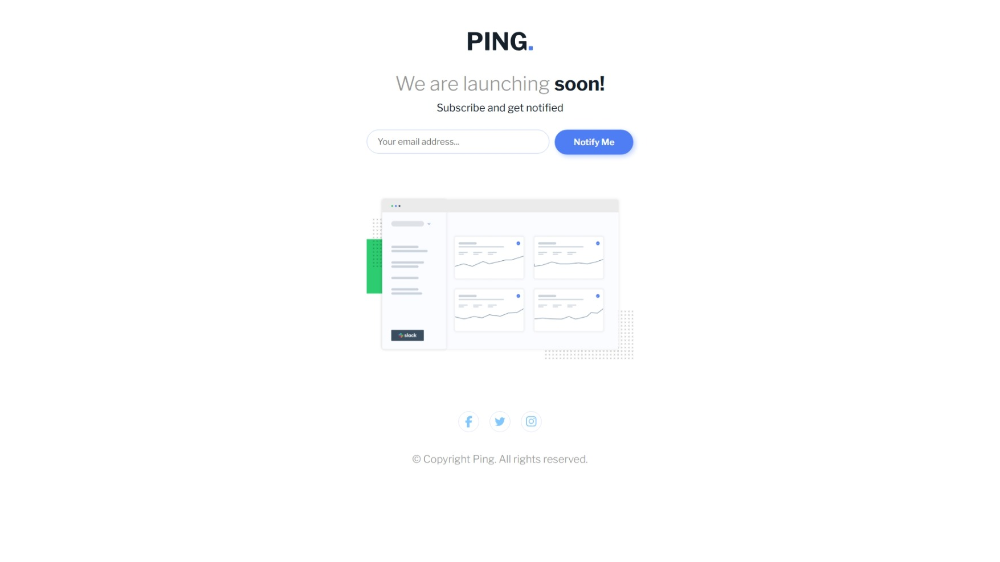

# 📬 Ping Coming Soon Page

A responsive single-column **coming soon landing page** for Ping, built with HTML, CSS, and JavaScript. The page includes an email input with validation, styled alerts, and clean layout suitable for mobile and desktop screens.

 <!-- Replace with your screenshot -->

🔗 Live Site: [View Demo](https://github.com/anjsachu/dev-labs/tree/main/frontendmentor/ping_coming_soon_page)  
🧩 Challenge: [Frontend Mentor – Ping Coming Soon Page](https://www.frontendmentor.io/challenges/ping-single-column-coming-soon-page-5cadd051fec04111f7b848da)

## 📚 What I Learned

- Implementing **form validation** using JavaScript
- Styling forms and error states for better UX
- Writing clean, semantic HTML structure for accessibility
