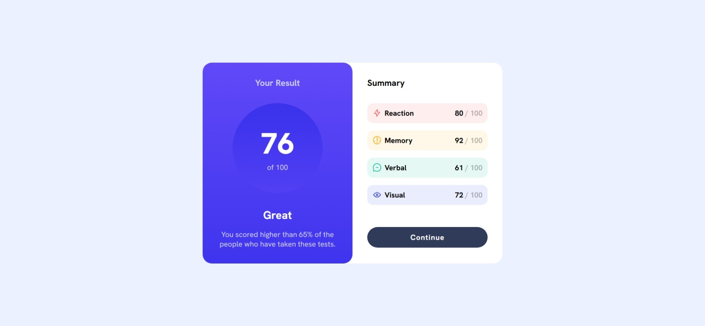

# 📊 Results Summary Component

A responsive and accessible **results summary card** built using HTML and CSS. This component visually presents a user's test score along with a breakdown of different performance categories.

🔗 Live Site: [View Demo](https://github.com/anjsachu/dev-labs/tree/main/frontendmentor/results_summary_component)  
🧩 Challenge: [Frontend Mentor Challenge Link](https://www.frontendmentor.io/challenges/results-summary-component-CE_K6s0maV)

## 📚 What I Learned

- Creating visually balanced layouts using Flexbox
- Using CSS custom properties for color themes
- Enhancing UI with accessibility and responsive design in mind
- Structuring components for clean, semantic HTML
